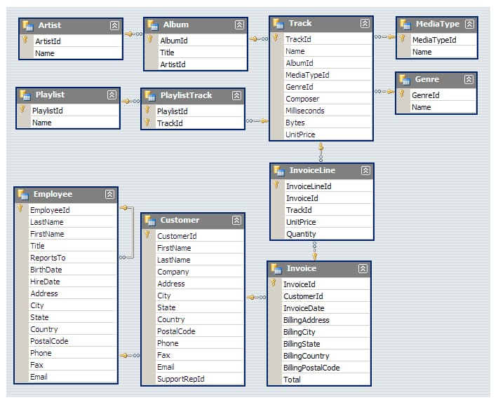

# SQL_Project_Muisc_Data_Analysis
SQL project to analyze online music store data

This project involves analyzing a music data store using SQL queries. The goal is to extract meaningful insights from the dataset, which includes information about artists, albums, tracks, and genres. This analysis can help understand trends, popular genres, and artist performance. 

## TOOL 
MYSQLWORKBENCH

Schema- Music Store Database

